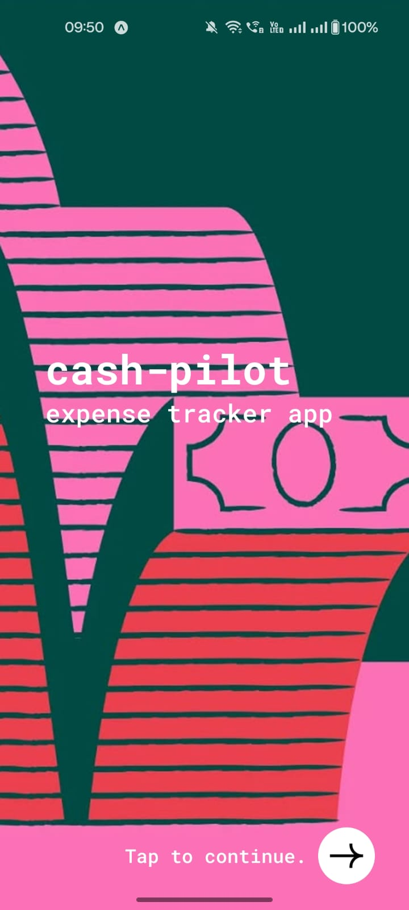
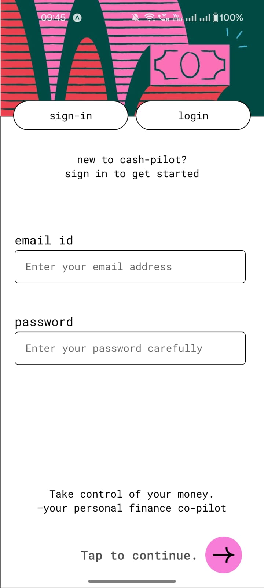
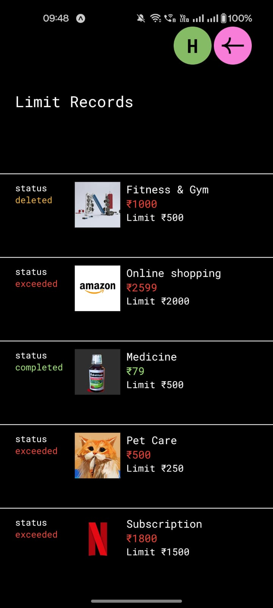
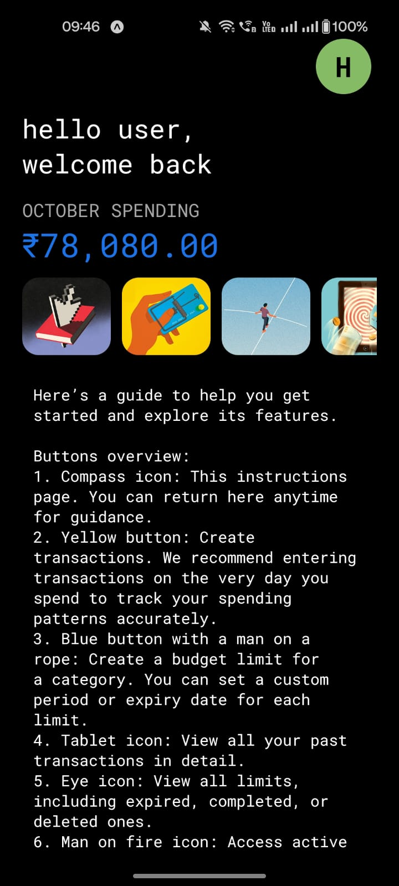
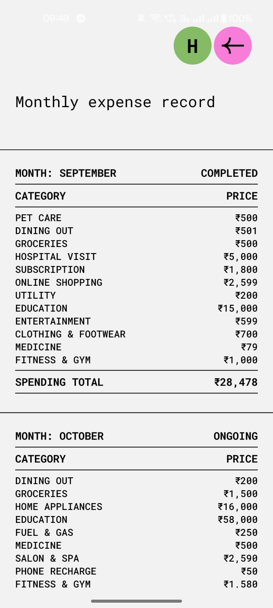
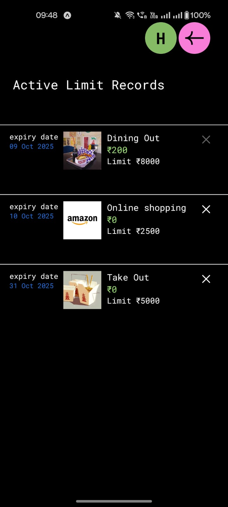
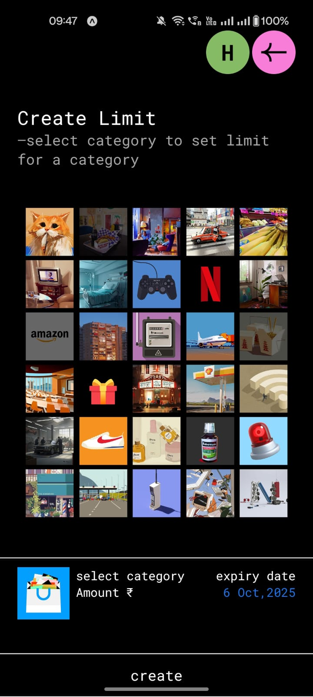
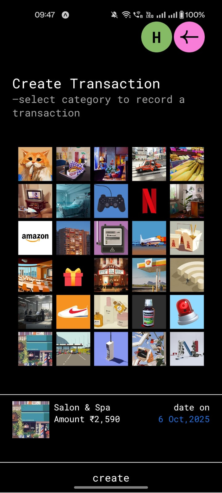
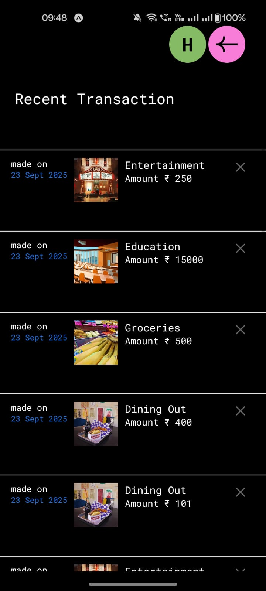

# Expense Tracker — FARM Stack
### 🧩 About
Expense Tracker is a personal finance management app built using the FARM stack — FastAPI, React Native, and MongoDB, designed and developed with Expo, VS Code, and Figma.

It helps users set spending limits, track expenses, and analyze monthly spending efficiently through a clean and intuitive interface.

### ⚙️ Tech Stack
  * Frontend: React Native + Expo
  * Backend: FastAPI (Python)
  * Database: MongoDB (NoSQL)
  * Design Tools: Figma (UI/UX Design)
  * IDE: Visual Studio Code

### 🚀 Features
1. Category Limits — Set budget limits for each spending category.
2. Transaction Log — Record every transaction with date, category, and amount.
3. View Ongoing Limits — Track your currently active category limits.
4. Limit History — Review limits that are completed, exceeded, or deleted.
5. Monthly Summary — Visualize your total spending per category for each month.
6. Budget Violation Alerts — Get notified when you exceed your set budget limi

### 📸 App Preview

 
 &nbsp;&nbsp;
  
 &nbsp;&nbsp;
  
 &nbsp;&nbsp;
  
 &nbsp;&nbsp;
  
 &nbsp;&nbsp;
  
 &nbsp;&nbsp;
  
 &nbsp;&nbsp;
  
 &nbsp;&nbsp;
  
 &nbsp;&nbsp;
  
 &nbsp;&nbsp;

🧑‍💻 Developer - Hrithika S  
📍 Chennai, India
